This repo contains the files I used to make my slides for the Digital Humanities expo held at the University of Otago on the 14th of October, 2019

The make_ _slides script triggers the individual scripts for making each slide, and saves each finished slide as a vector drawing appended to a PowerPoint file as well as an image file. 

You will not be able to make the last batch of slides, as you do not have my data, nor will any of them work with Google's Open Sans font installed, but you can see from the code what I did to make the slides.

## Slide 1

Slide 1 Introduces the American time use survey with a activity unfamiliar to NZ audiences.

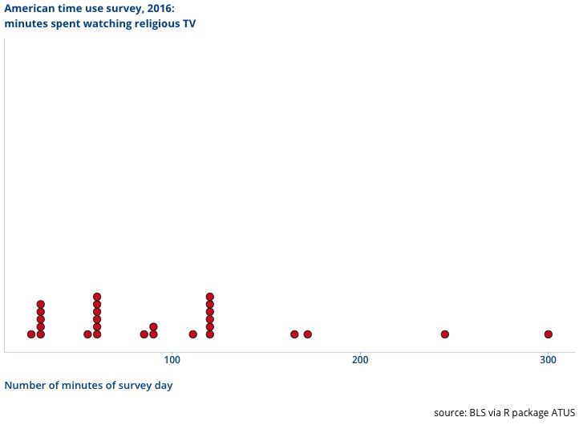

## Slide 2

Slide 2 Demonstrates that the ATUS is sparce data, not recording things people did zero of, and if you introduce that back into the data you get a pattern more faimilar to New Zealand viewers. Make the point the sparse decision is a decision of the people that ran the survey, and it can effect the kind of questions you ask.

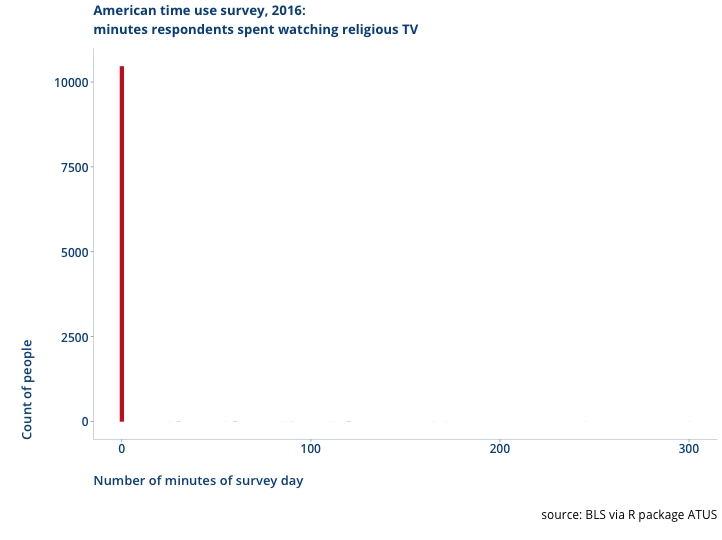

## Slide 3

Slide 3 show the number of travel (journey) times in the ATUS.

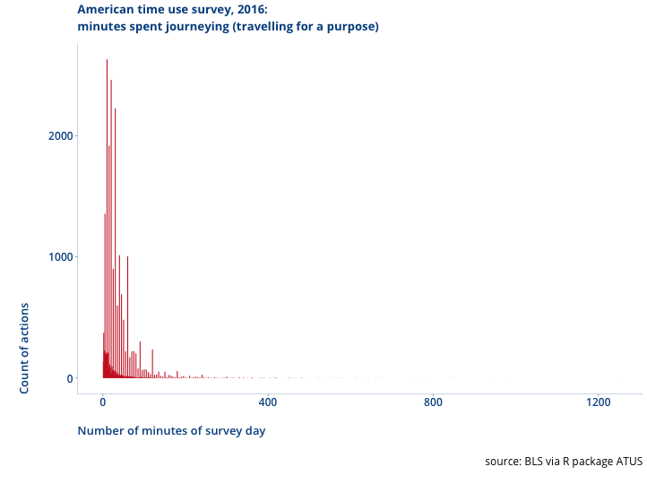

## Slide 4

Slide 4 show the number of travel (journey) times in the ATUS for journeys under two hours. Point out that in the real world the pattern is not that few people live 9 minutes from things, vast numbers live 10 minutes from things, then few people live 11 minutes from things. This is peoples understadning of "time" in practice causing them to round travel times. This makes a difference for some kinds of questions. Make the point this is the people providing the information, so you need to be aware of what the concepts mean to them

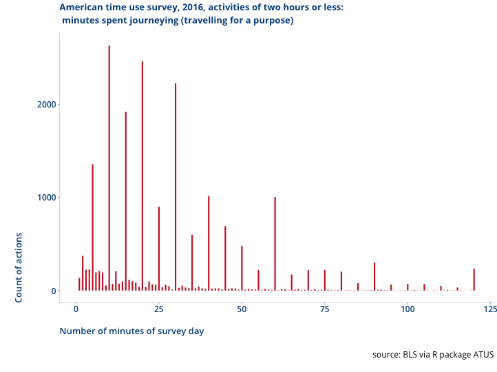

## Slide 5

Slide 5 introduces the New Zealand Election Survey as a source of public data about New Zealanders attitudes. As an example, showing changes in attitudes to the Treaty of Waitangi.

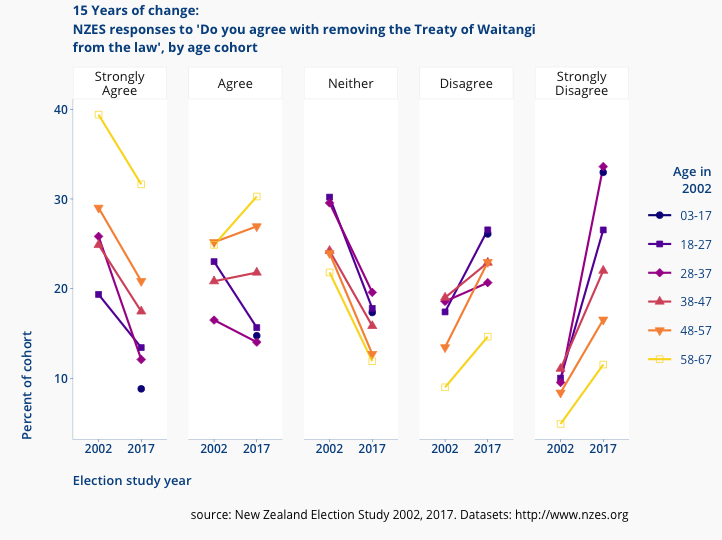

## Slide 6

Slide 6 proposes polarisation as maximally disliking one or more of the major 4 political parties (and contrasts it to maximally liking one of the four main parties). Make the point that the validity of representing polarisation in this manner is based on my convincing the readers that this is a fair treatment. Make the point that this is my rearrangement of the data, not the people who conducted the survey nor the particpants in it.

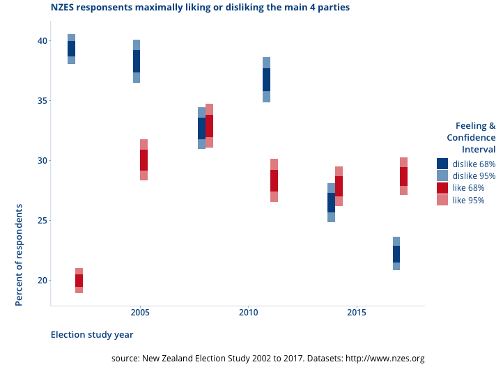

## Slide 7

Slide 7 contrast NZ's change in polarisation with Australia's change (same questions asked in the Australian Election Study about their main four parties), just because it is really interesting.

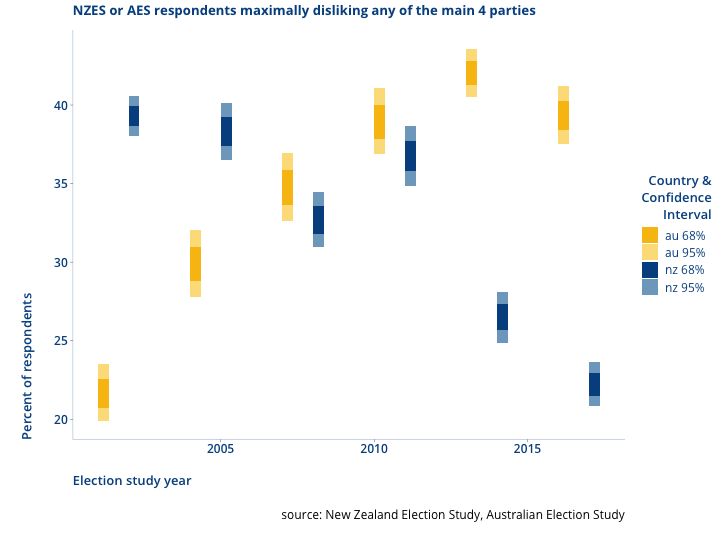

## Slide 8

Slide 8: using the NZEs to set the scene for the next segment- pointing out that the white supremacy recruiting demographic (of strongy anti-treaty and strongly anti-immigrant) in NZ is very tiny (and has gotten tinier)
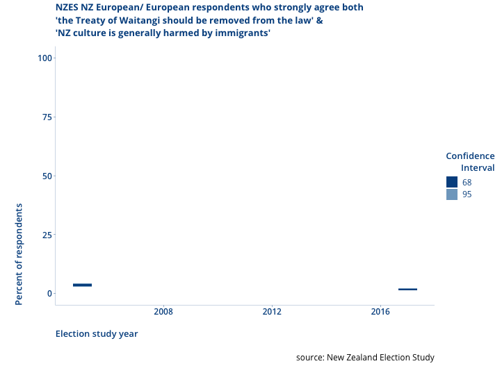

## Slide 9

Slide 9: Explaining how for the Southern/Molyneux visit I first looked at the response to Phil Goffs statements & how NZ vs offshore was very different in their components.

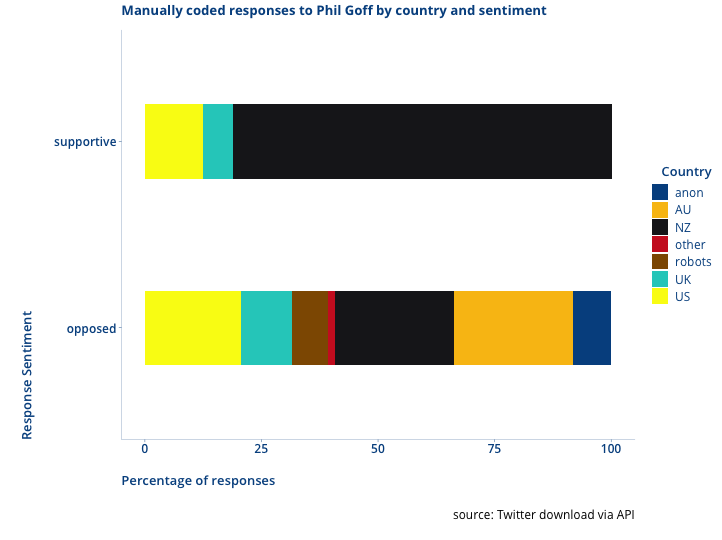

## Slide 10

Slide 10: Explaining how the physical location of Twitter posters are identifiable from their posting times, even if they don't say where they are. Make the point that is is a finding that comes from the aggregate of the data about an account, not the individual posts.

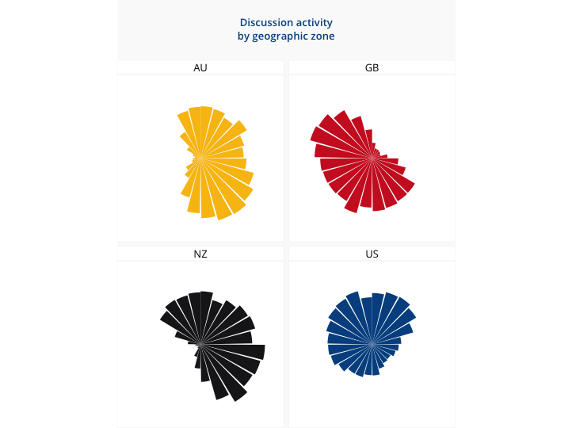

## Slide 11

Slide 11: Across the Twitter debate around Southern & Molyneux, you can identify influences on posters by how much they like accounts that Southern & Molyneux like, vs how much they like accounts liked by people that never like Southern & Molyneux. Make the point this is cobining different datasets about accounts in a aggregate way relative to each other. It comes from the aggregate of the aggregates.

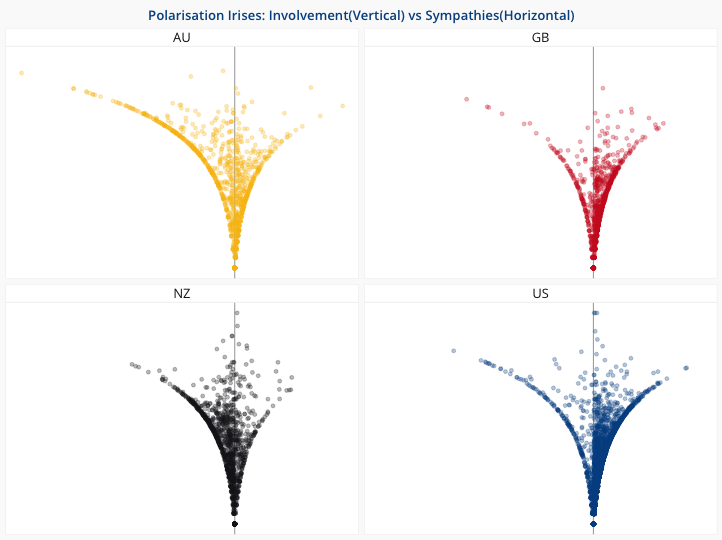

